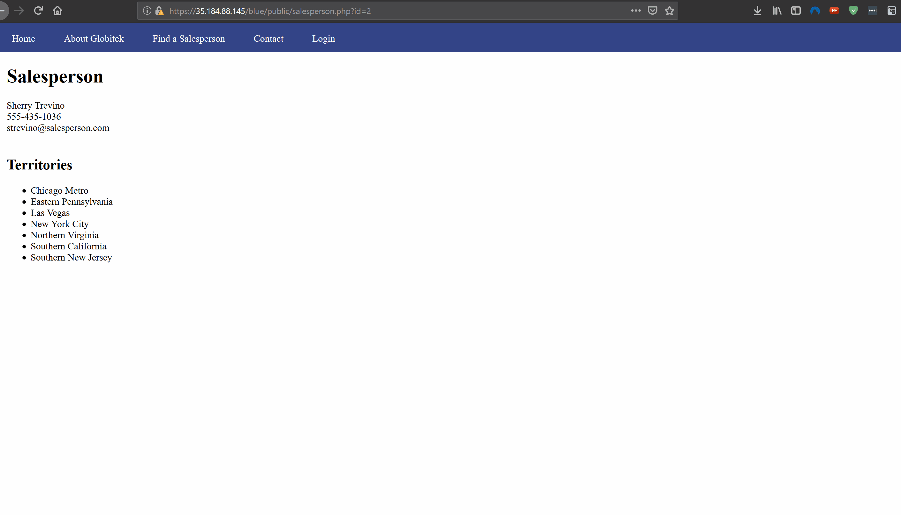
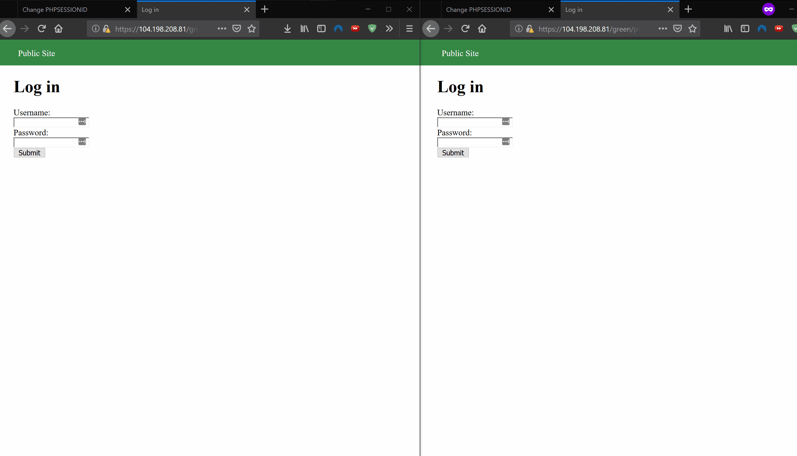
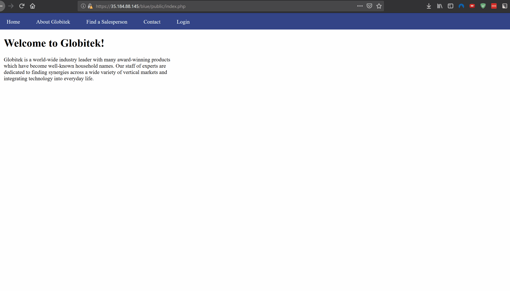
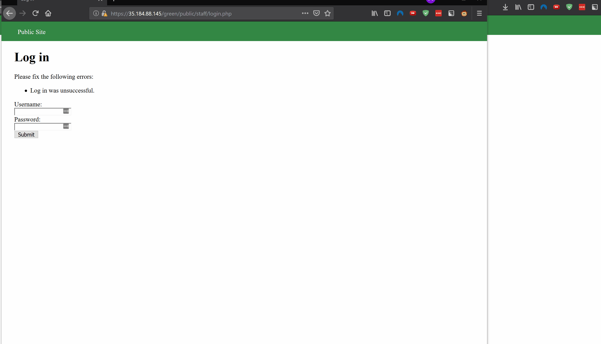
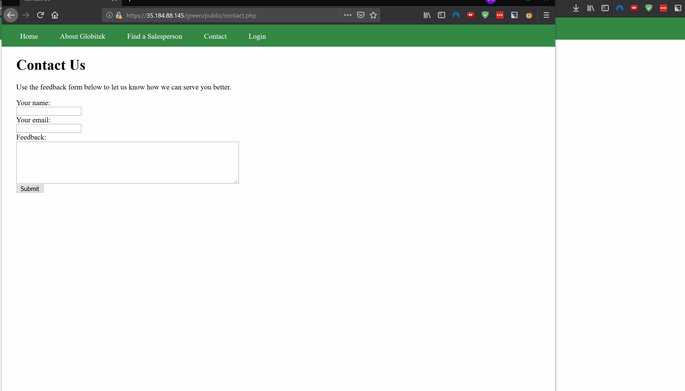

# Project8 Simulated Attacks

## Insecure Direct Object Reference:  
Overview: Malicious actors can enumerate objects by simply changing the id number on the url:  

## Session Hijacking:  
Overview: Malicious actors can mimic someone's identity by stealing a victim's session id and injecting it in their own session.  

## SQLI:  
Overview: Malicious actors can inject SQL code on the id number on the url:  

## User Enumeration:
Overview: Malicious actors can check if a username exists on the database simply by getting a different css styling when there is a match on the database. The error message becomes bold when there's a match.  

## XSS (Document Cookie Extraction):
Overview: Malicious actors can embed a script that allows them to extract cookie data.
